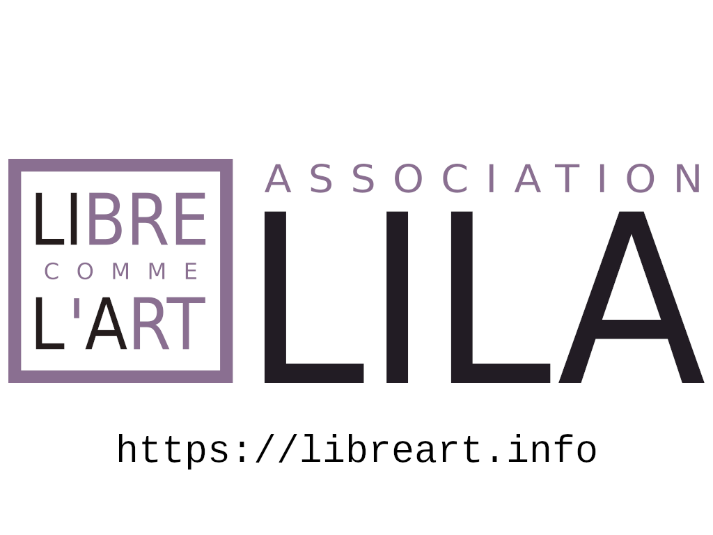
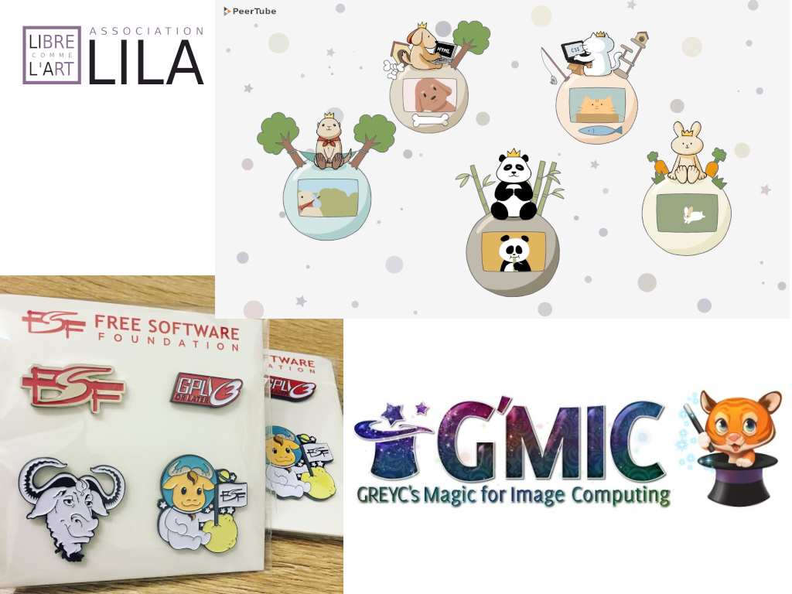
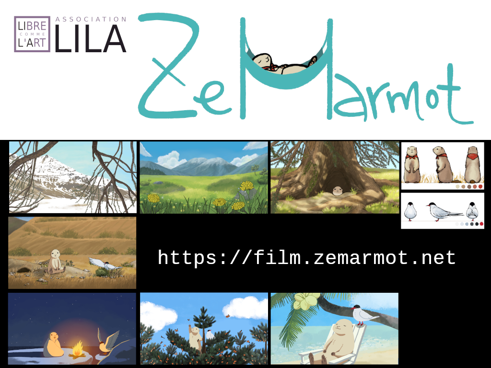

# LILA: Libre comme l'Art

## Title slide

LILA is a non-profit production based in France, mostly known for the
animation film project "ZeMarmot", directed by Aryeom Han and our
development work on GIMP.

## Slide 1

As side project, mid-2018, we were commissionned by the Framasoft
non-profit for the crowdfunding video for Peertube (a "Youtube-like"
video platform, to install on one's own server, with peer to peer
streaming). The crowdfunding was a big success.

We also designed cool enamel pins for the Free Software Fundation
end-of-year fundraising.

A few months ago, we welcomed the G'MIC software, well known as a
plug-in for GIMP, Krita, and other software, under our umbrella,
collecting donations officially in order to support their development.

## Slide 2

Still ZeMarmot remains our main project, which Aryeom continuously
produced throughout 2018, still alone on artistic side because of
our limited funding. Production is going well, at its own rythme.

Finishing the main pilote is still our main goal and focus for the
foreseeable future. And while we do so, we will continue to contribute
to Free Software, especially as part of GIMP core team for 7 years now,
that is even before we started ZeMarmot movie project.
