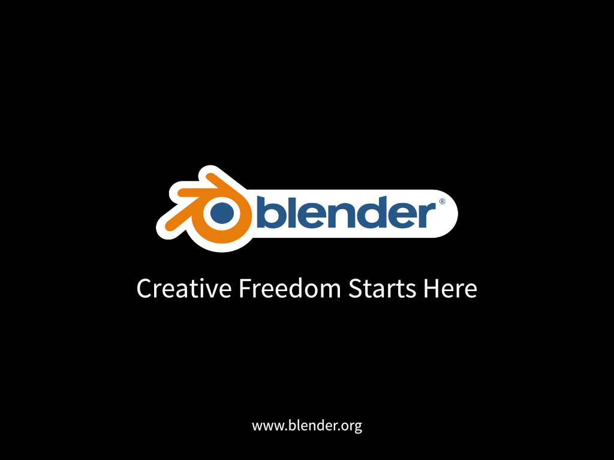
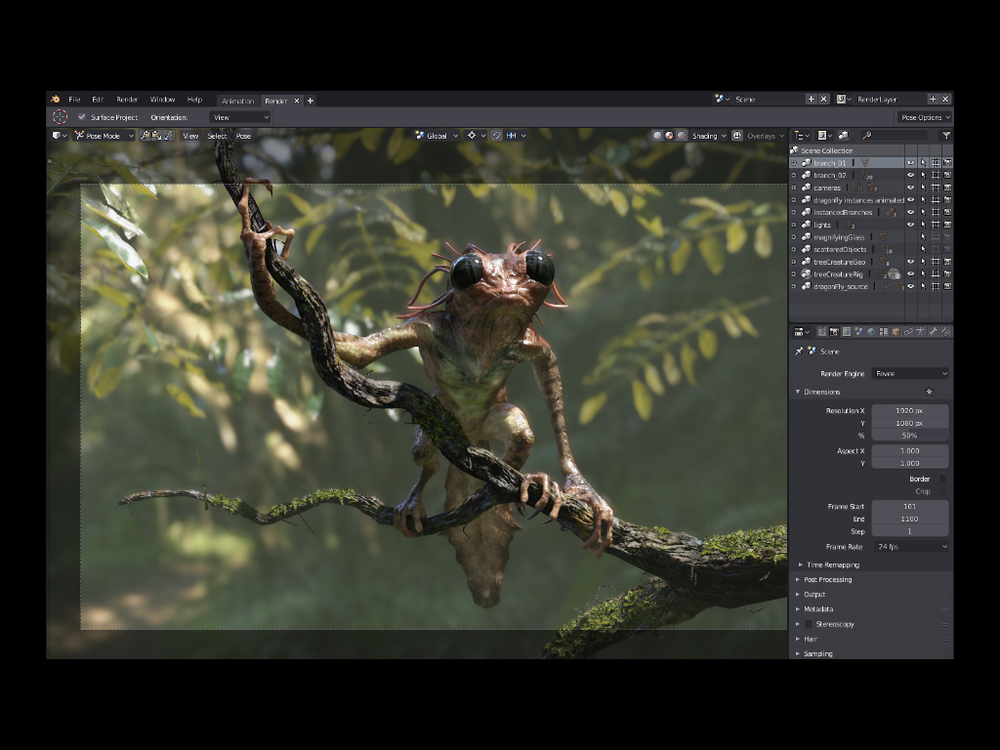
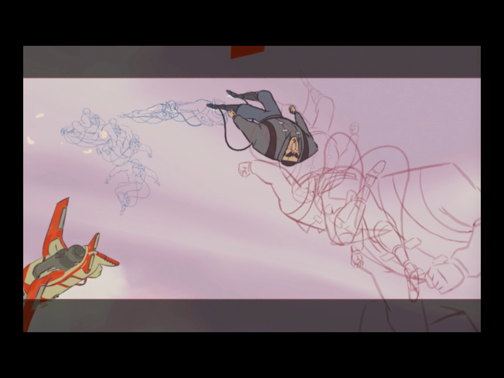

# Blender

-- Slide 0 --

Blender is the free and open source 3D creation suite. It supports the entirety of the 3D pipeline—modeling, rigging, animation, simulation, rendering, compositing and motion tracking.

-- Slide 1 --

From a new PBR Viewport to redefined Workspaces, Blender 2.80 brings updates all across the board.

No other release of Blender has been met with so much anticipation! It’s the accumulation of 3 years of time and hundreds of months of work by developers from the Blender community.

The Blender team decided to tackle workflow; not only by improving UI configurations and layouts, but especially by bringing back 3D tools and editing where it belongs – in 3D space. Everything should be real-time and interactive, whether you make photorealistic environments or cartoon animation.

The Blender 2.8 release is expected by July 2019.

-- Slide 2 --

Enjoy [this reel](https://www.dropbox.com/s/cj06i4jc0hjcmz5/blender_reel_05.mov?dl=0) featuring some great work created with Blender.
