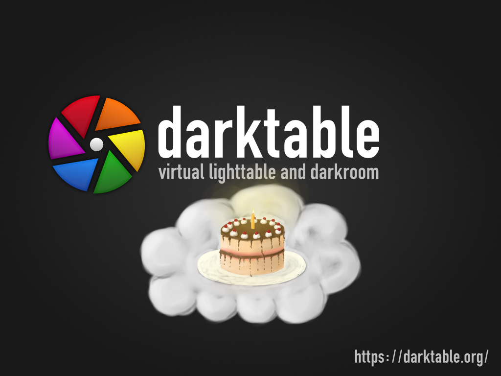
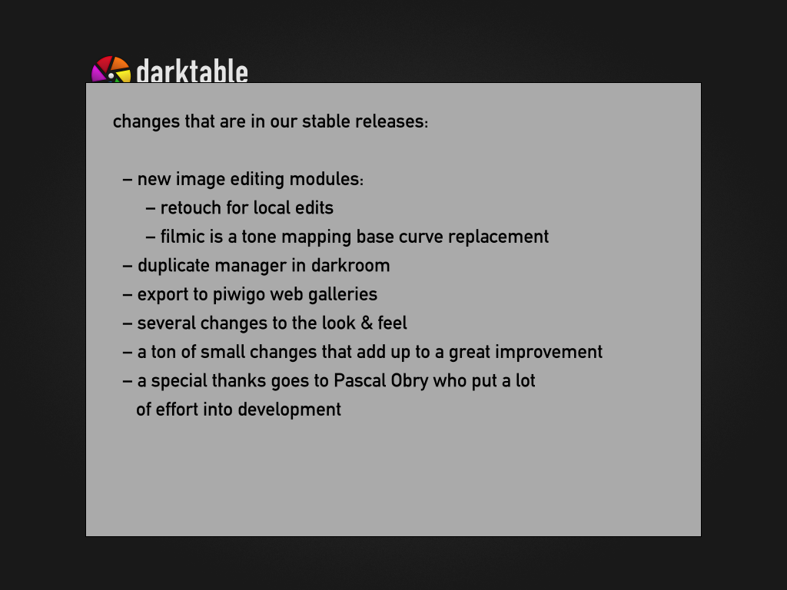
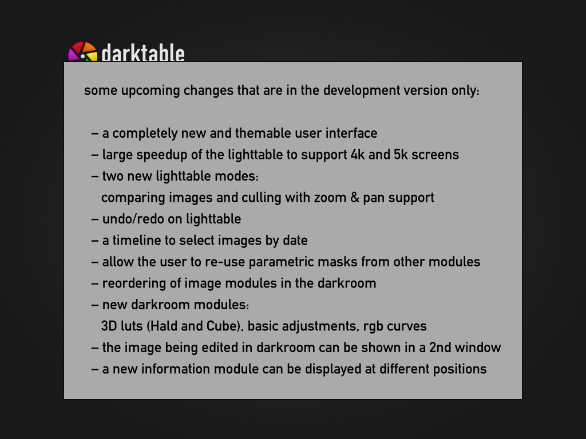

# darktable

### slide 0

  - darktable is a raw converter and program to manage your digital images, processing images with high precision.
  - darktable celebrates 10 years anniversary this year. there will be cake.

### slide 1

  changes that are in our stable releases:

  - new image editing modules:
       - retouch allows local edits to an image, for example to remove blemishes
       - filmic simulates the look of real film stock and how it deals with overexposure
  - a duplicate manager in darkroom makes it easy to have more than one edit of the same image and keep track of that
  - export to piwigo web galleries
  - several changes to the look & feel
  - a ton of small changes that add up to a great improvement
  - a special thanks goes to Pascal Obry who put a lot of effort into development

### slide 2

  upcoming changes that are in the development version only:

  - a completely new and themable user interface
  - large speedup of the lighttable to support 4k and 5k screens
  - two new lighttable modes:
       - the exposé mode helps with comparing images
       - the "culling" mode displays a fixed number of consecutive images and allows to pan and zoom them
  - undo/redo support in lighttable for tags, color labels, rating, metadata, deleted history stack, pasted history stack and applied style.
  - a timeline to select images by date
  - allow the user to re-use masks from other modules anywhere down the pipe
  - reordering of image modules in the darkroom
  - new darkroom modules:
       - 3D luts (Hald and Cube)
       - a new module "basic adjustments" has been added. it allows to adjust the exposure, highlight compression, contrast, brightness and saturation.
       - rgb curves
  - the image being edited in darkroom can be shown in a 2nd window for full screen preview on a separate monitor
  - a new information module can be displayed at different positions

  not on the slides due to space limitation:

  - some color-pickers were added to these modules: watermark, split toning, graduated nd
  - several slideshow improvements: start at any image, configurable delay and better reactivity
