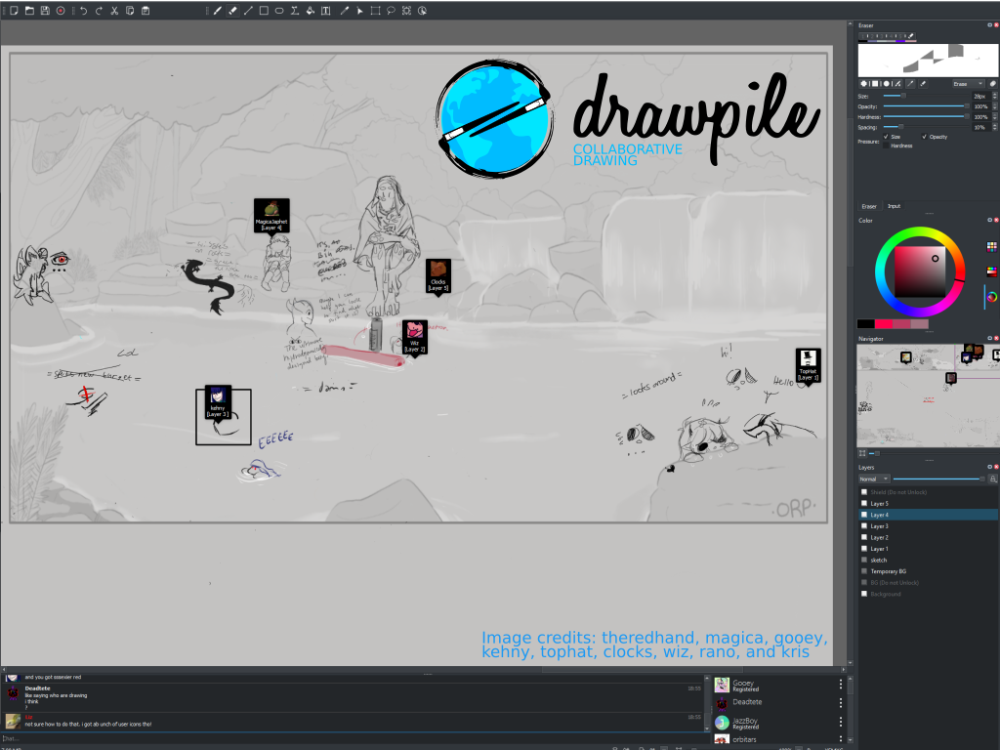

# Drawpile

-- Slide 0 --

Drawpile is a collaborative drawing application that allows you to share a canvas with people from all over the world in real time. It can also be used offline as a regular drawing program and the built-in server provides a quick way to share your canvas on a local network even without an Internet connection.

While primarily a drawing program, Drawpile also has basic animation features, such as onionskin layers and a preview flipbook.

-- Slide 1 --

After a year of work, version 2.1 was released in early 2019, introducing some key improvements such as fixes to the paint engine, more efficient session history management and finer grained user access controls.

-- Slide 2 --

Future plans include a new server that allows fast logins even for very long running sessions, layer groups, and support for MyPaint brushes.

