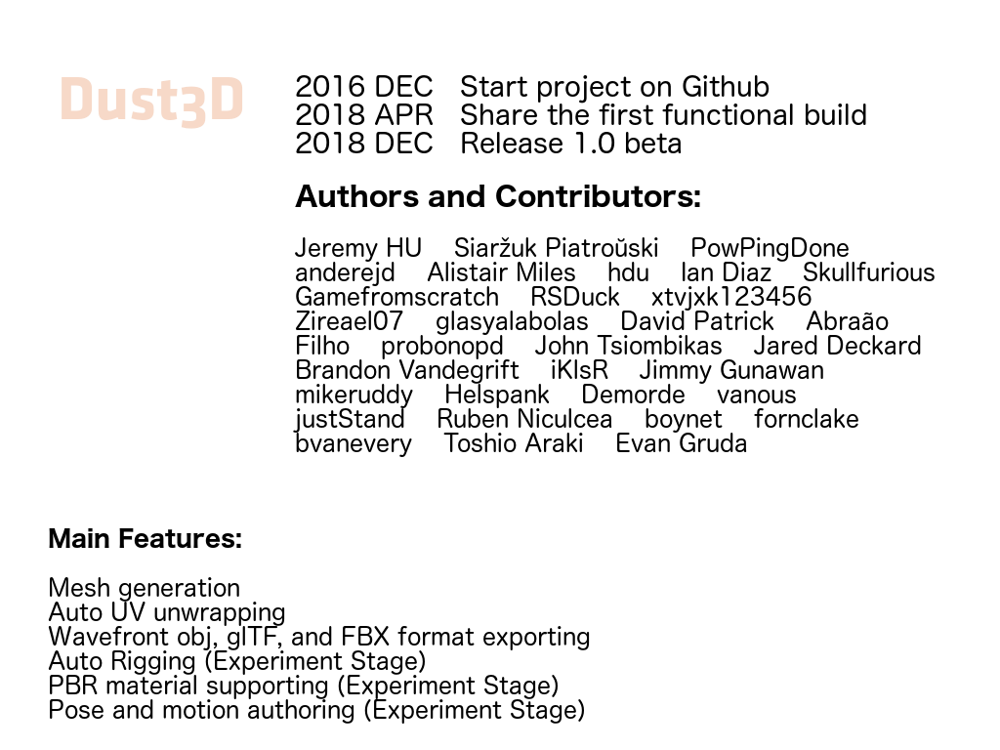

# Dust3D

-- Slide 0 --

Dust3D is a quick 3D modeling software. It automatically generates a watertight mesh from nodes drawn by the user.

-- Slide 1 --

2016 DEC   Start project on Github  
2018 APR   Share the first functional build  
2018 DEC   Release 1.0 beta  

Main Features:

Mesh generation  
Auto UV unwrapping  
Wavefront obj, glTF, and FBX format exporting  
Auto Rigging (Experiment Stage)  
PBR material supporting (Experiment Stage)  
Pose and motion authoring (Experiment Stage)  

-- Slide 2 --

2019 Plans:

Add more features about gamedev for indie  
Release 1.0 stable version
