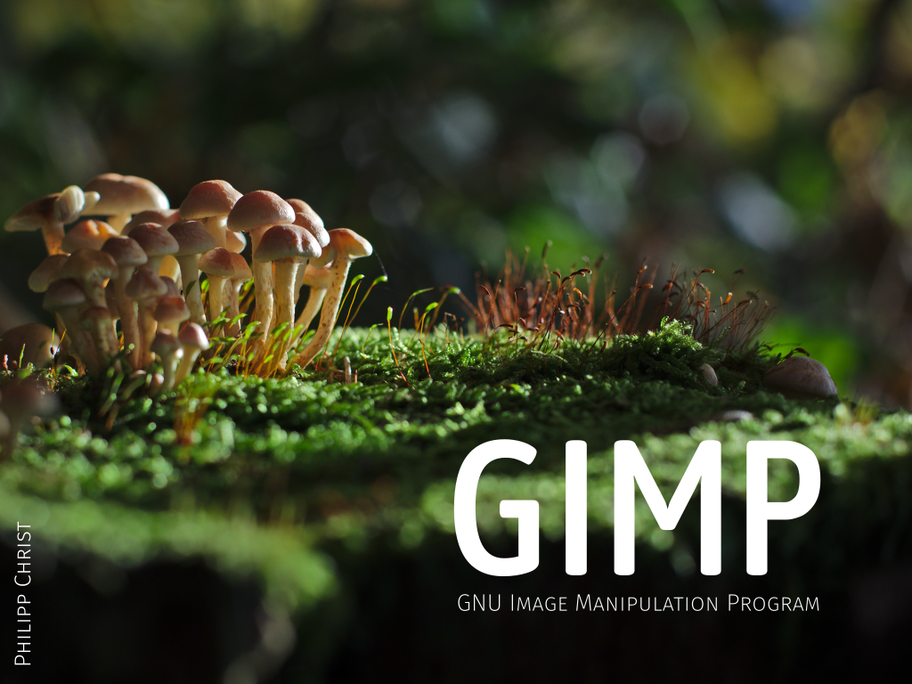
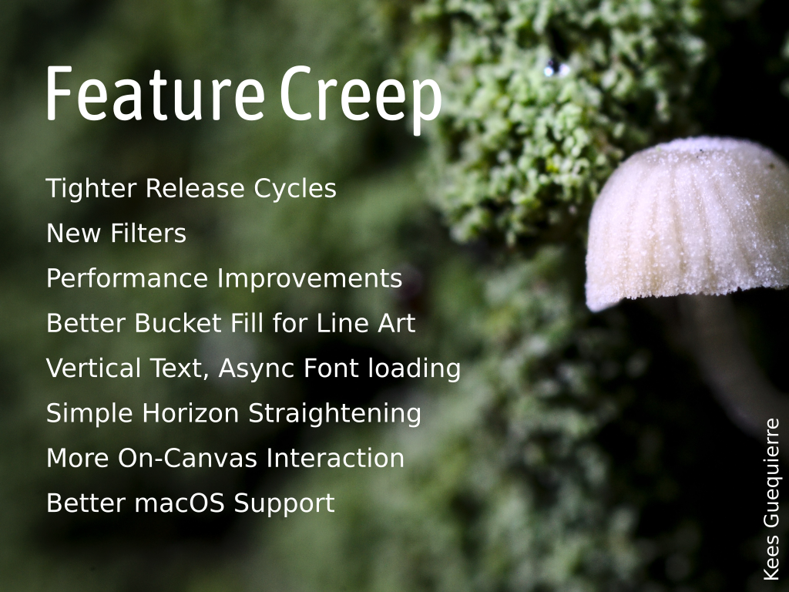
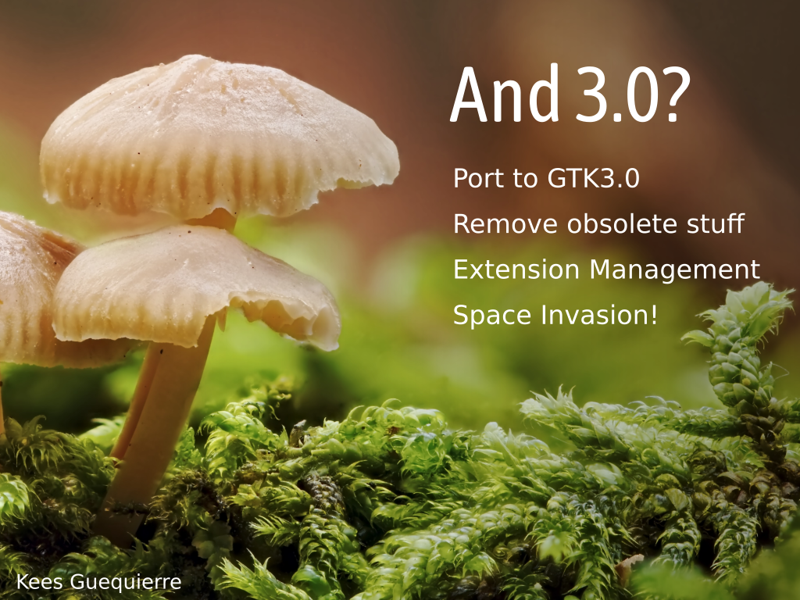

# GIMP

### slide 0

GNU Image Manipulation Program, or GIMP for short, is a free/libre general image editor for Linux, macOS, and Windows. The program is designed for building complex multilayered projects and provides dozens of selection, transformation, painting, and utility tools to build those. GIMP also ships with well over a hundred built-in filters for color adjustment and effects. Even more filters and scripts to process images and automate mundane tasks are available as 3rd party projects.

### slide 1

Since releasing GIMP 2.10.0 at the previous Libre Graphics Meeting, the project started including new features in stable releases. Some of the highlights are:

- Initial support for DDS and HEIF images
- New filters: _Spherize_, _Recursive Transform_, _Little Planet_, _Long Shadow_
- Numeric input and cusp nodes support  in the _Curves_ filter
- Performance improvements all over the program, including painting
- Vertical text support and asynchronous fonts loading
- Simple horizon straightening
- 32-bit parametric brushes
- Easier brush and pattern creation workflow
- Line art detection in the Bucket Fill tool for comic artists
- CIE xyY support in color readouts (Color Picker and Sample Points)
- Various usability improvements in transformation tools
- _Sample Merged_ option added to the _Heal_ tool and fixed in the _Clone_ tool
- On-canvas layer selection
- Better user experience on macOS, including signed binaries

### slide 2

The ongoing development largely focuses on the GTK3-based user interface for version 3.0, as well as major refactoring that comes with it. The plan is to remove as many obsolete design and code decisions as possible before moving on to implement non-destructive editing planned for version 3.2.

Two other ongoing efforts are extensions management and a subproject called _Space Invasion_.

For extensions management, the idea is to provide a centralized add-ons repository and an easy way to install/update/remove those from within GIMP.

_Space Invasion_ is the next logical step to provide first-class support for any RGB color spaces.