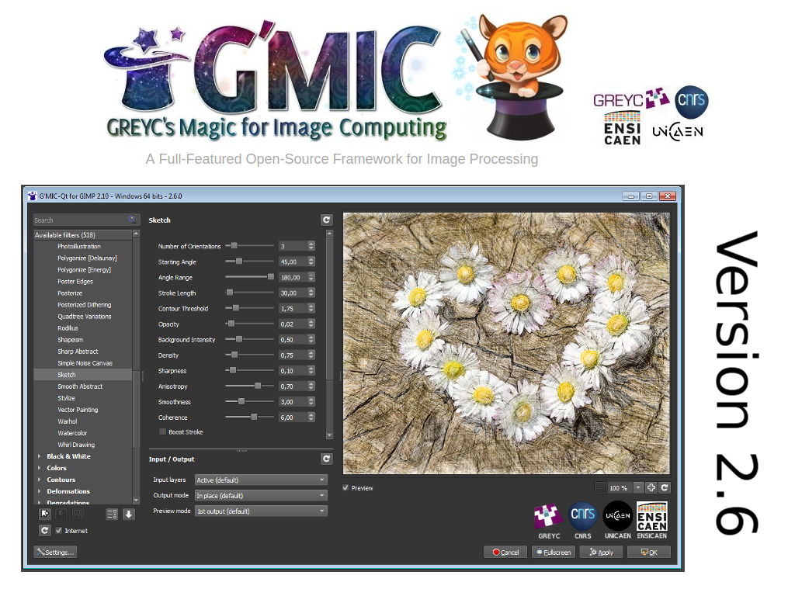
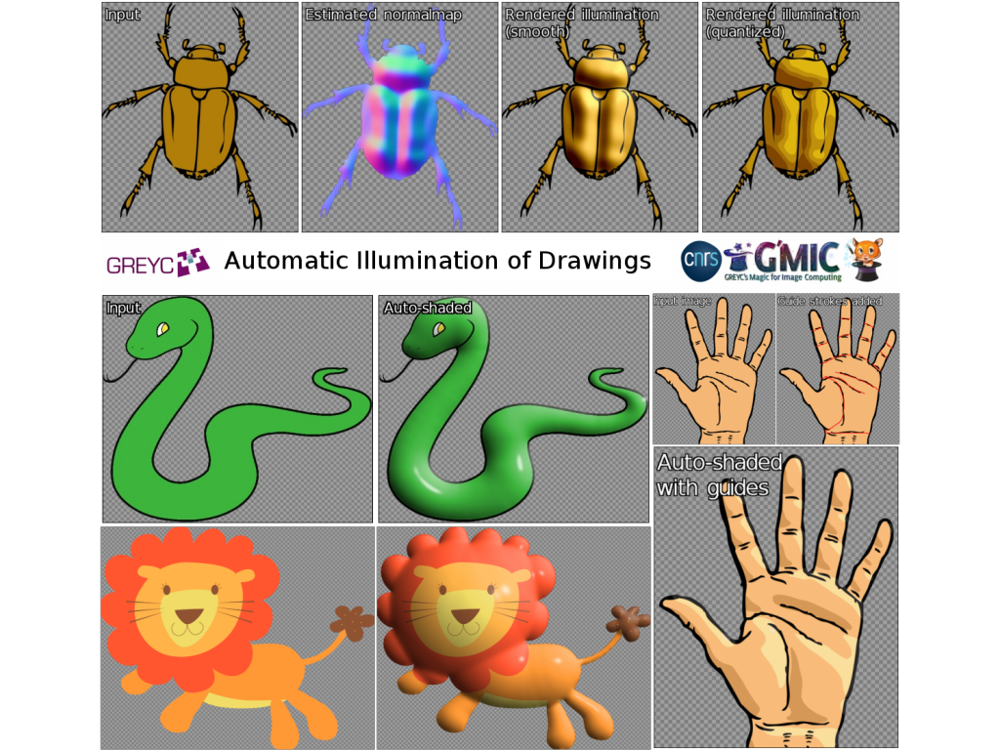
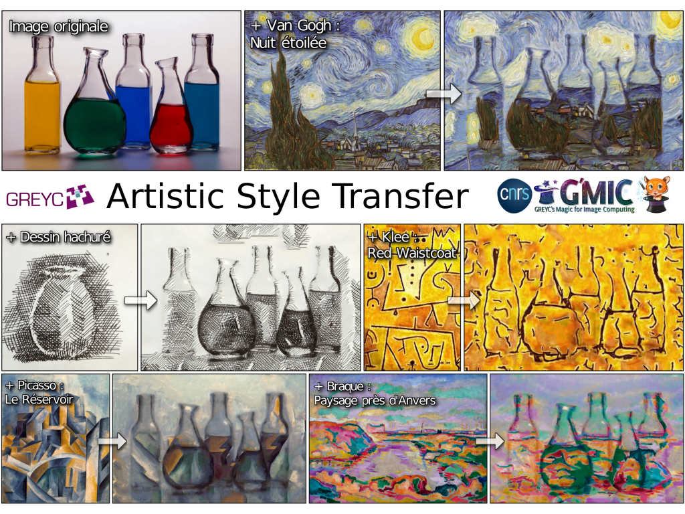

G'MIC (speaker's notes)
--------

### Slide 1:

**G'MIC** is a full-featured open-source framework for [image processing](https://en.wikipedia.org/wiki/Image_processing), distributed under the [CeCILL](http://www.cecill.info/index.en.html) free software licenses (LGPL-like and/or GPL-compatible). It provides several [user interfaces](https://en.wikipedia.org/wiki/User_interface) to convert / manipulate / filter / visualize **generic image datasets**, ranging from 1D scalar signals to 3D+t sequences of multi-spectral volumetric images, hence including **2D color images**.

One of its most popular interface is a user-friendly Qt-based plug-in **G'MIC-Qt**, already available for [GIMP](http://www.gimp.org), [Krita](http://www.krita.org) and [Paint.NET](https://www.getpaint.net/). It also has a command-line interface for doing batch image processing.

**G'MIC** current version number is **2.6**, released in April 2019.

### Slide 2:

A lot of new image processing algorithms and filters have been added since last year. The plug-in proposes now more than **500 filters** to play with. As we cannot detail all the new features, we focus on two spectacular filters recently added.

The first one tries to automatically illuminates a flat-colored drawing (e.g. a clip-art image), to make it look as a 3D object. It is based on an algorithm that estimates the 3D depth map of a 2D input image, followed by a Phong-based lighting. Various parameters can be set to define the light source, the rendering type of the illumination, etc. The filter can also output the estimated bump maps and normal maps.

### Slide 3:

The second one allows to transfer the *style* from a template image (usually a painting) to an input photograph. Basically, it tries to re-create the content of the input photograph, using only elements from the style image.
The filter already proposes pre-defined styles, but custom styles can be also used (just add the style image as the top layer). As a consequence, it is a very versatile filter. To our knowledge, it is the only existing "style transfer" filter available from a painting program: *Photoshop does not have this!*

**G'MIC** now accepts donations, so if you appreciate the efforts done on this project, do not hesitate to support the developers!
