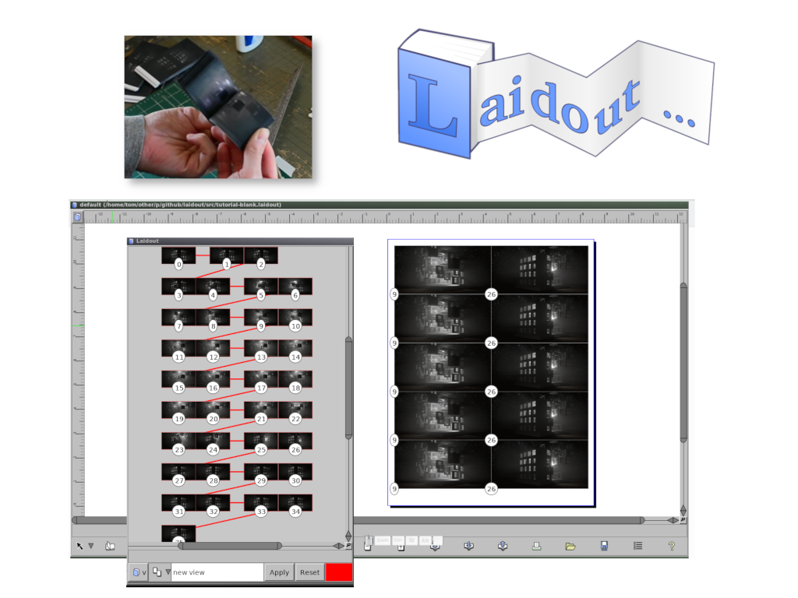
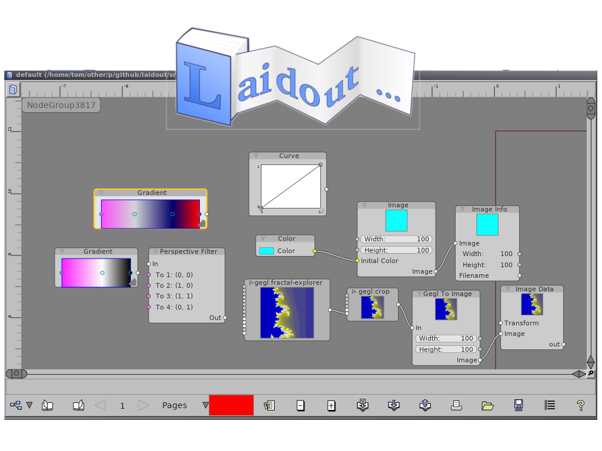
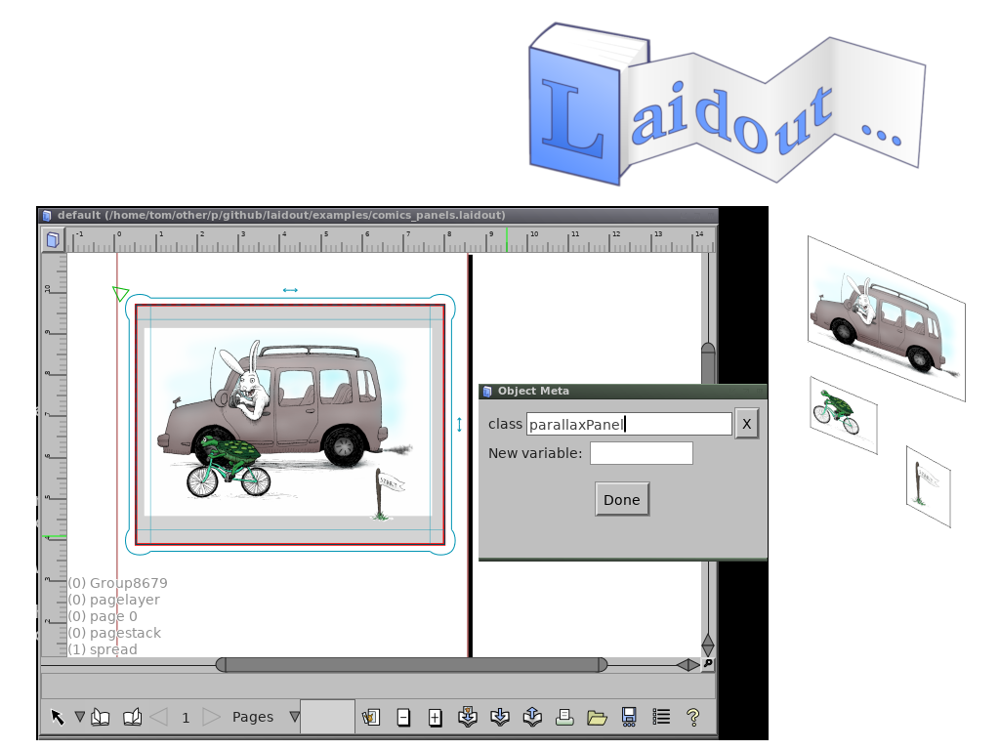

# Laidout

-- Slide 0 --

Laidout continues to explore a variety of edge cases in and around the world of 
vector graphics. For instance, creation of physical flipbooks from animated gifs, thanks
to a new image loader based on GraphicsMagick.

-- Slide 1 --

Also still in development is a node set to allow building combinations
of vector and bitmap images based on graphics libraries such as Gegl,
and, possibly coming soon, G'mic.

-- Slide 2 --

Laidout can now export to html. With special tagging of objects, this exporter
can use embedded svg and some javascript to create illustrations with
interactive parallax.

See more at the Comic Book Workflow workshop on Saturday!

