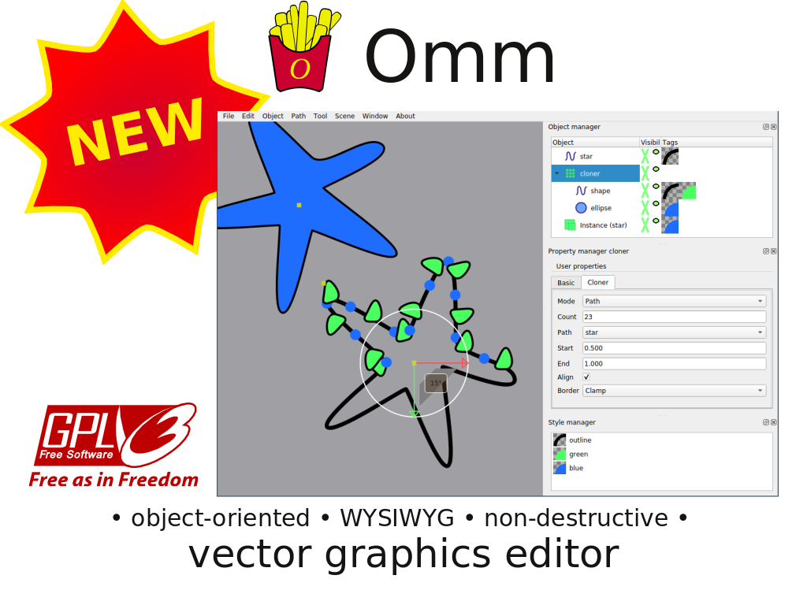
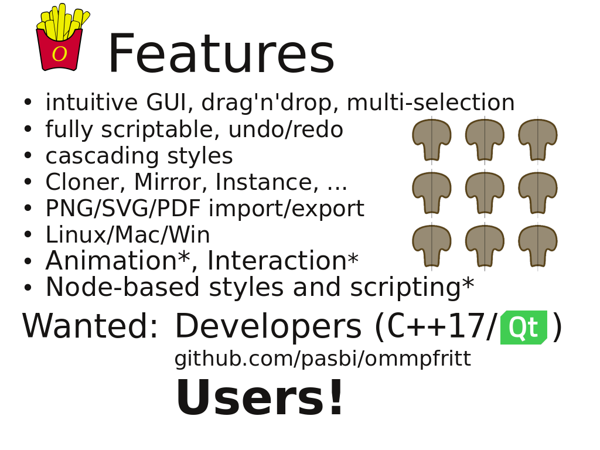

- general purpose vector graphics editor
- design goals: intuitive usage, WYSIWYG (= what you see is what you get), non-destructive

----

- more technical and less artistical than Inkscape
- more visual than TikZ
- similar concept as Cinema 4D or blender, but omm is entirely 2D

- Omm provides **many special objects** and only **few tools**. E.g., cloning/arranging using Cloner-**object** rather than duplicate- and arrange-**tools**
- Cloning along Path: all properties are accessible anytime in the cloner-object (path, number of clones, ...)

----

- non-exhaustive feature list, there's much more
- asterisk*: future features
- announce talk about non-destructive editing in theory and practice at Friday 10:50

