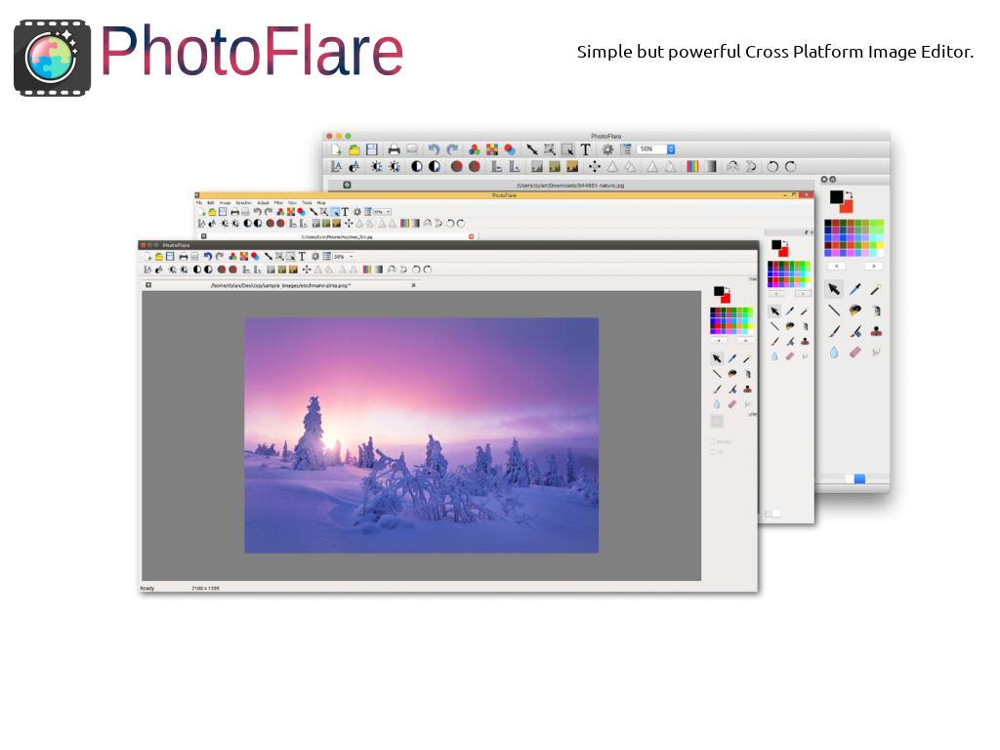
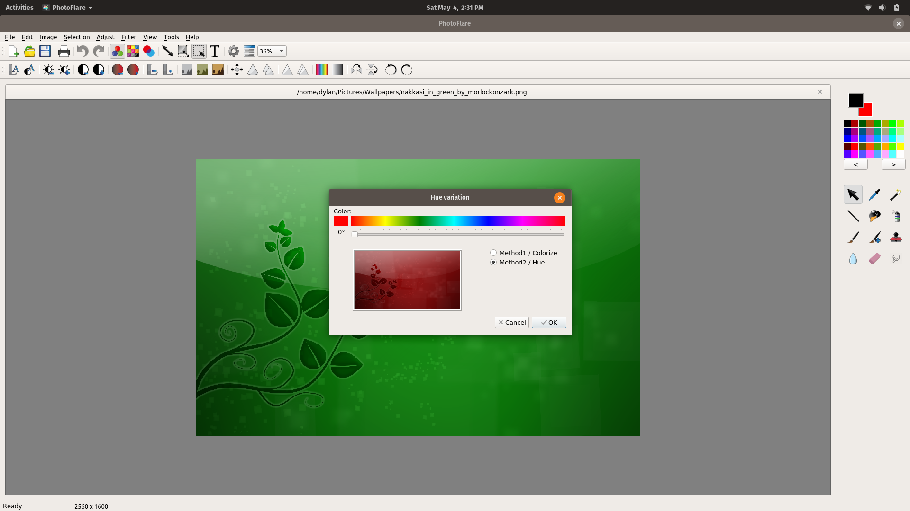
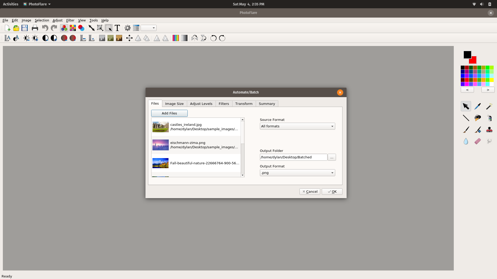

# PhotoFlare (speaker's notes)

PhotoFlare is an Open-Source image editor distributed under the GPL license. It is fully Cross Platform software and thanks to the wonderful community it has been translated into five world languages. Technology wise the editor is built upon C++, Qt5 and GraphicsMagick.

## Main Features
- Image cropping/resizing.
- Hue Variation.
- Gradient creation.
- Filters.
- Batch processing.
- Window modes (Tabs or MDI).

## Hue Variation

Last year we released **eight** bug fix releases to the v1.5 series of the project. We got Travis CI and automatic AppImage builds setup on GitHub to help the project grow. This year our project pushed out two more bug fix releases (v1.5.7, v1.5.8). We got featured in a podcast ([linuxgamecast.com](https://linuxgamecast.com/2018/12/lwdw-147-linux-in-2019/)) and online magazine ([libregraphicsworld.org](http://libregraphicsworld.org/blog/entry/photoflare-interview-2019)). The stable v1.5 series has been accepted into Debian repositories and is available since Ubuntu 19.04 as an [official package](https://packages.ubuntu.com/source/disco/photoflare).

## Batch processing

Going forward we have [big plans](http://photoflare.io/v2/) for v2.0, we hope to push this project even further with features such as Layer support and LibMyPaint brushes. PhotoFlare v1.5.x continues to become available in [more repositories](https://repology.org/project/photoflare/versions) within Linux distributions. We also have both a [daily](https://code.launchpad.net/~photoflare/+recipe/daily) and [stable](https://code.launchpad.net/~photoflare/+recipe/stable) PPA for up to date versions. To keep this project in motion we would appreciate some donations, code contributions or new translations.
