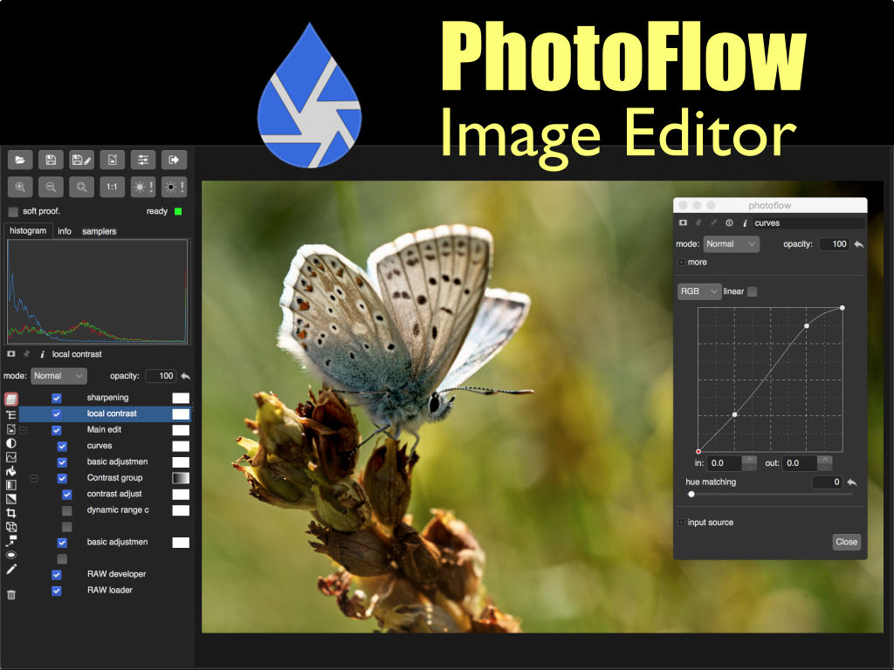
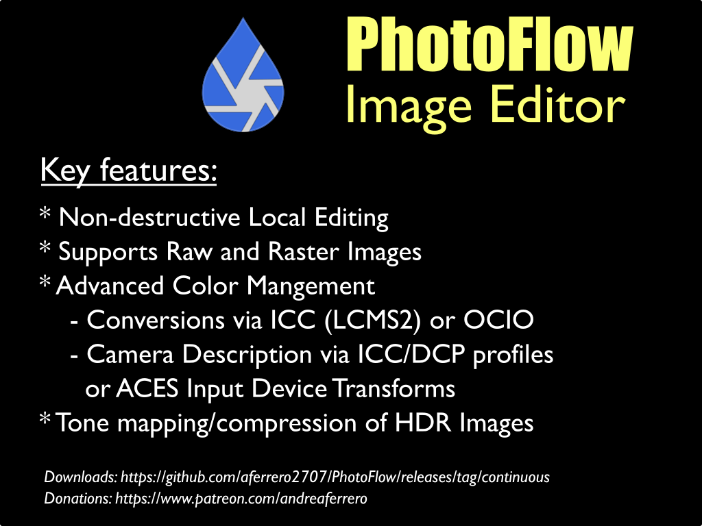
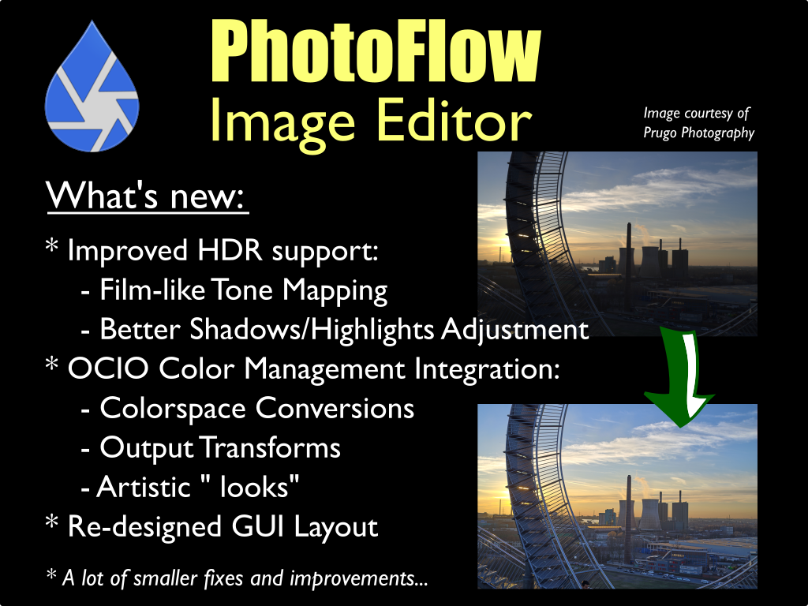

# photoflow

### slide 0

  - PhotoFlow is an editor for Raw and raster images
  - It was born about 5 years ago, and is active development

### slide 1

  The key features:

  - advanced color management:
       - integrates LCMS2 and OCIO for colorspace conversions, and allows editing in RGB, Lab and CMYK
       - provides soft proofing and paper simulation 
  - editing is structured via non-destructive adjustment layers, that can be re-ordered and grouped
  - supports editing and tone-mapping of HDR images. Can load floating-point DNG, TIFF and EXR files
  - local editing is possible via flexible opacity masks
  - small memory footprint even when processing large images, thanks to the underlying VIPS processing pipeline

### slide 2

  Recent developemnts:

  - HDR dynamic range compression and tone mapping has be re-written and improved
        - new film-like tone mapping curve with flexible parametrisation, for a natural-looking contrast adjustment and highlights compression
        - a new shadows/highlights adjustment tool that is based on guided filtering for suppressing halos and gradient inversion artefacts
        - all tools support editing of un-bounded linear RGB buffers
  - OCIO has been integrated as an alternative color management system, in addition to the already supported LCMS2 (ICC-based)
        - can be used for colorspace conversions as well as for targeting specific output devices
        - OCIO "look" transforms for "artistic" conversions are also supported
        - allows to integrated the image processing into an ACES-based workflow
  - The user interface as been improved and simplified, leaving a maximum of space for the image preview
