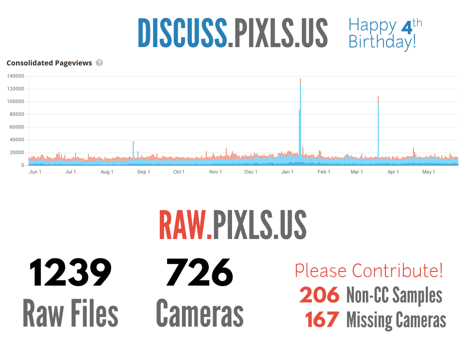
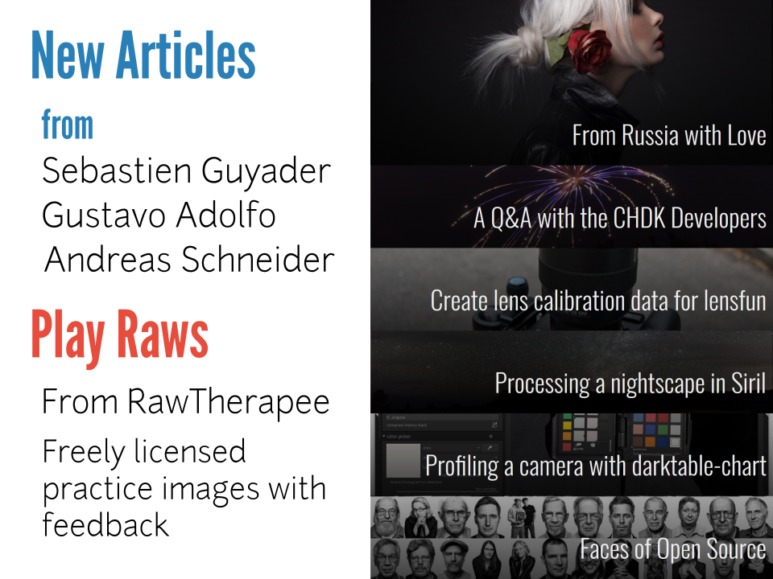

# PIXLS.US: Free/Open Source Photography Community

## Title slide

PIXLS.US is a community of photographers focused on using and advancing Free Software.

It's aim is to build a community based on _photography_ across many different (Free) projects.

## Slide 1

The Discourse forum just celebrated it's 4th birthday!

Traffic has been steadily increasing, roughly doubling every year with approximately 3,400 users right now.

RAW.PIXLS.US is the repository of raw image files from as many cameras as possible (with a Free license).

Currently have 1,239 raw files from 726 difference cameras.

We still need more!  Please check the site to contribute CC-licensed samples (to replace non-CC files, or from missing cameras).

## Slide 2

### New Articles
The community is fantastic and helpful!

There are new articles this year from:

* Sebastien Guyader
* Gustavo Adolfo
* Andreas Schneider

There have been new interviews, tutorials, and workflows.

### Play Raws
Borrowed from the RawTherapee community, the community shares raw files freely for others to use and share their process for developing them.

Come join in the fun and help grow an awesome community!
