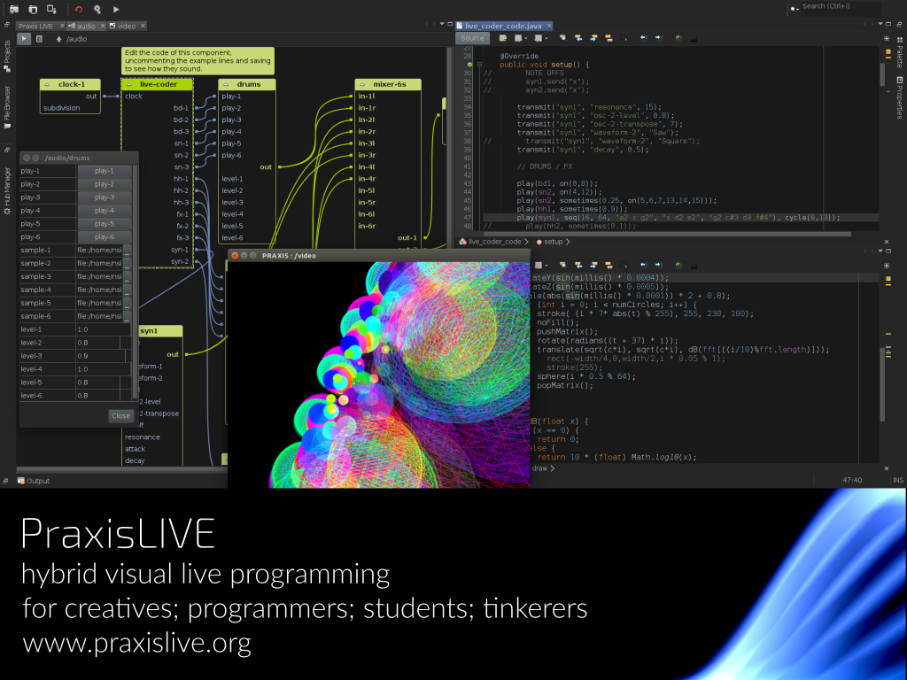
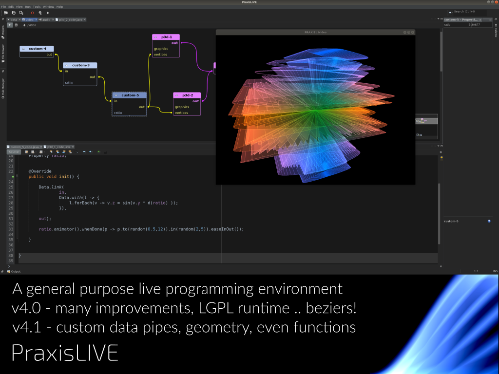
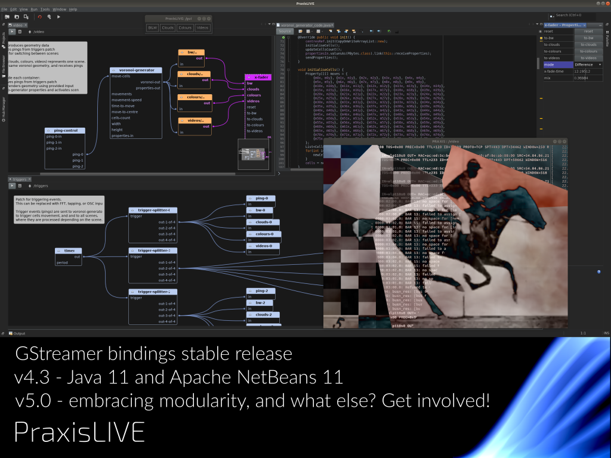

# PraxisLIVE

-- Slide 0 --

PraxisLIVE is a hybrid visual live programming IDE and runtime, bringing aspects of Smalltalk, Erlang and Extempore into the Java world. It has a history and particular focus on creative coding and visualisation, with strong support for working with Processing, GStreamer video and custom OpenGL graphics.

-- Slide 1 --

PraxisLIVE v4 was released shortly after LGM 2018, with a wide range of improvements. The runtime was relicensed under LGPL so that it can be easily redistributed as part of a standalone project. And the graph UI was improved with bezier curves - which obviously got most attention!

Developments through the year have focused on PraxisLIVE as a general purpose programming system, but still with benefits for creative coding. The new data pipes support added in v4.1 mean that realtime data passed between components is no longer limited to the built-in types like video frames or audio buffers - we can now pass geometry and even functions with ease.

-- Slide 2 --

In early 2019, generous sponsorship of the Java bindings for GStreamer, maintained as part of PraxisLIVE, allowed these to reach a first stable release. Improved access to GStreamer features is slowly being added to PraxisLIVE, with network streaming, video export and better GPU integration on its way.

Released a week ago, PraxisLIVE v4.3 updates on top of Apache NetBeans 11 to support running on and developing with OpenJDK 11 for the first time. Later this year, v5 will fully embrace the modularity changes in the Java ecosystem. What else it will include? That is still up in the air, so come and get involved in the discussions!
