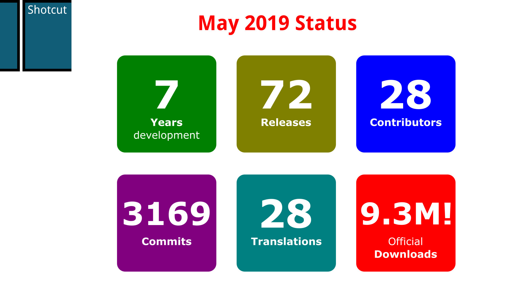
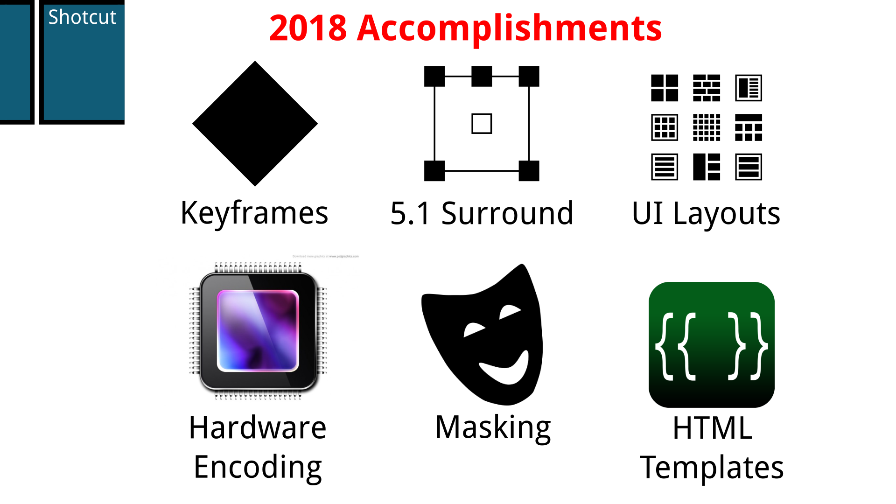

# Shotcut

Shotcut is a free, open source, cross-platform video editor. It is licensed under the GPLv3 license and available for Linux, Windows, and macOS.
It was created by the lead developer of the MLT multimedia processing framework, and another MLT developer is a major contributor. Thus, it obviously uses the MLT, which makes heavy usage of FFmpeg and frei0r plugins.

## May 2019 Status

Shotcut is over 7 years in development and has been making new releases almost every month with every platform released at the same time.

It shows 28 contributors on GitHub resulting in 3169 commits, but 95% of these come from the main two developers. So, it lacks a healthy level of code contribution despite providing SDKs for each OS to ease development given its numerous dependencies. Of course, translators are contributors as well, and there are now 28 translations.

Shotcut has become a very popular project resulting in over 9.3 million trackable downloads through its website and download partners. This does not count the numerous other download sites and package repositories.

## 2018 Accomplishments

2018 saw many feature additions, which resulted in a period of instability followed by stabilization.
The biggest feature and most amount of work was the addition of keyframes to animate effect parameters.

Through the QtWebKit module, Shotcut has the unique ability to use HTML for titles and effects. Now it has user-extensible HTML templates that are editable in its WYSIWYG HTML editor.

Also, support was added for:

- 5.1 surround sound
- multiple saved UI layouts
- hardware-accellerated video encoding across all 3 platforms that is easy to detect and configure
- masking for filters or to draw the alpha channel for composited video tracks

While Shotcut has an OpenGL-based image processing framework through the Movit project, that still needs a lot of work to improve stability. Other areas that need signficant work are documentation and, of course, additional features that the insatiable users expect.
