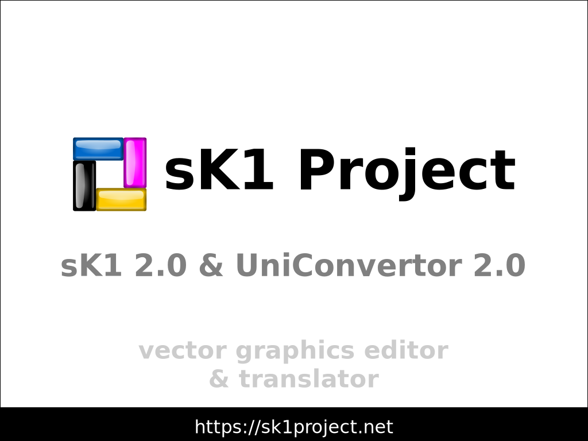
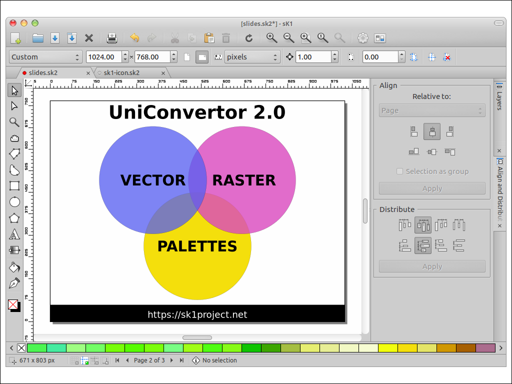
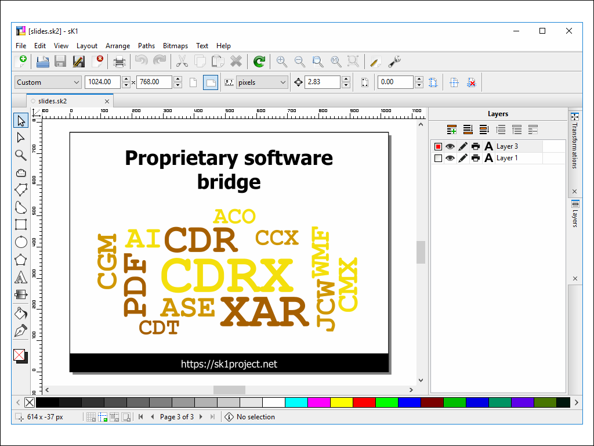

# sK1 Project

### slide 0

  - sK1 2.0 is professional quality crossplatform illustration program. sK1 2.0 supports professional publishing features, such as multiple page document, CMYK and SPOT colors, ICC color management, professional precise printing and press-ready PDF output.
  - UniConvertor is a command line tool/library. It uses SK2 document object model to convert one file format to another.

### slide 1

  Unlike previous releases UniConvertor became a core part of sK1. It does all the backend jobs. Now UniConvertor joins vector and raster graphis processing and translation. Also it manages color info and color palettes.

  All import/export filters have been redesinged and rewritten from scratch to improve translation quality and provide reliable development/support workflow.

  We specifically focused on CorelDraw compatibility as for regular CDR files and for CorelDraw clipart file formats (CMX, CCX, CDRX) and different versions of CorelDraw palettes (CPL and XML). *Now the most unique feature of UniConvertor is an export to CDR and CMX file formats.* 

### slide 2

 Supported vector graphics file formats:
  - SK2 - sK1 2.x graphics files
  - SVG - Scalable Vector Graphics files
  - PDF - Portable Document Format files
  - CDR - CorelDRAW Graphics files
  - CMX - CorelDRAW Presentation Exchange files
  - CCX - CorelDRAW Compressed Exchange files
  - XAR - Xara graphics files
  - WMF - Windows Metafile files
  - PLT - HPGL cutting plotter files
  - SK1 - sK1 0.9.x graphics files
  - SK - Sketch/Skencil files
  - FIG - XFig files
  - CGM - Computer Graphics Metafile files

 Supported palette file formats:
  - SKP - sK1 palette files
  - GPL - GIMP palette files
  - SCRIBUS_PAL (XML) - Scribus palette files
  - SOC - LibreOffice palette files
  - CPL - CorelDRAW palette files
  - COREL_PAL (XML) - CorelDRAW X5-X7 palette files
  - ASE - Adobe Swatch Exchange files
  - ACO - Adobe Color files
  - JCW - Xara color palette files

And more than 100 different raster graphics file formats.

We have released RC4 snapshot for sK1 and UniConvertor, but final stable release is scheduled this summer.
